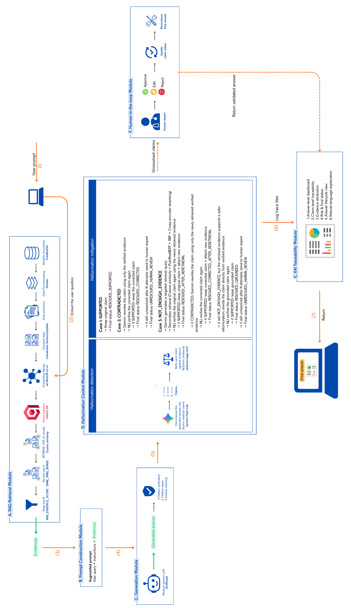

## Project Goal 🔬
The main goal of this project is to improve the reliability, trustworthiness, and explainability of medical LLM-generated answers.

### The proposed system combines:
- **RAG** to ground generated answers in retrieved biomedical evidence.
- **Hallucination detection** to verify generated claims against the retrieved evidence.
- **Hallucination mitigation** to correct or recover unsupported and contradicted claims.
- **Human-in-the-loop review** for claims that cannot be safely resolved automatically.
- **XAI traceability** to explain how each answer was generated, verified, corrected, and finalized.  

→ The overall objective is to build a reliable medical QA assistant that generates evidence-grounded, traceable, and explainable biomedical answers.

## Main Objectives

### 1. Evidence-Grounded Medical Question Answering with RAG

- Use PubMedQA as the main biomedical QA dataset.
- Retrieve relevant biomedical evidence for each medical question.
- Use semantic dense retrieval and evidence filtering to select the most relevant context.
- Generate long-form medical answers grounded in retrieved evidence.
- Improve:
  - Answer relevance
  - Context recall
  - Context precision
  - Faithfulness
  - Citation consistency

**Purpose:** Reduce reliance on the LLM's internal knowledge and provide external evidence supporting generated answers.

### 2. Claim-Level Hallucination Detection

- Decompose each generated answer into atomic claims.
- Verify every claim against retrieved biomedical evidence.
- Use NLI-based verification to classify claims as:
  - `SUPPORTED`
  - `CONTRADICTED`
  - `NOT_ENOUGH_EVIDENCE`
- Estimate the hallucination risk of each answer.

**Purpose:** Detect factual problems at the claim level instead of treating the entire answer as simply correct or incorrect.

### 3. Hallucination Mitigation and Human-in-the-Loop Review

For problematic claims:

- `SUPPORTED` claims → keep unchanged.
- `CONTRADICTED` claims → attempt evidence-grounded correction.
- `NOT_ENOUGH_EVIDENCE` claims → perform targeted evidence re-retrieval.
- Re-verify corrected or re-retrieved claims.
- Escalate unresolved claims to human expert review.
- Reconstruct the final mitigated answer using validated claims.

**Purpose:** Move beyond hallucination detection by actively correcting or safely handling problematic claims.

### 4. Explainable AI and Traceability

Develop a post-hoc, evidence-based XAI dashboard that explains the complete answer lifecycle:

```text
Question
→ Retrieved Evidence
→ Generated Answer
→ Atomic Claims
→ NLI Verification
→ Mitigation Action
→ Final Claims
→ Final Mitigated Answer
→ Risk Level
→ Human Review Status
``` 

The XAI module show:  
- Why the answer was generated.
- Which evidence chunks were retrieved and used.
- Which claims were supported, contradicted, or lacked evidence.
- What mitigation action was applied to each claim.
- Which claims were kept, corrected, recovered through re-retrieval, or sent to human review.
- The hallucination risk and final answer status.
- Plain-language explanations for non-technical reviewers.

**Purpose:** Make the complete RAG and hallucination-control process transparent and auditable.

## Project Pipline


## Project Structure

The project is organized into three main notebooks and supporting data/configuration files.

###  `Notebooks`

- **`notebook 1 - 1000.ipynb`**  
  Implements the main **RAG retrieval and answer generation pipeline**. It loads the processed PubMedQA data, builds the Qdrant index, performs dense MiniLM retrieval with evidence selection, generates answers with BioMistral, verifies citations, repairs missing citations, and computes the main RAG and generation evaluation metrics.

- **`notebook 2 - 100.ipynb`**  
  Implements the **claim-level hallucination detection and mitigation module** on a fixed subset of 100 questions. It performs claim decomposition, NLI-based verification, targeted re-retrieval, evidence-grounded correction, final answer reconstruction, and the before/after ablation evaluation.

- **`notebook 3.ipynb`**  
  Implements the **XAI and traceability module**. It builds question-level, claim-level, and evidence-level explanations, computes risk levels, generates natural-language explanations, creates XAI visualizations, and provides a complete trace of the answer lifecycle.

### `data/`

Contains the processed PubMedQA data, embeddings, vector-index configuration, and experimental outputs.

#### `data/processed/`

Main processed files include:

- **`pubmedqa_qa.csv / .parquet`**  cleaned PubMedQA question-answer data.
- **`pubmedqa_chunks.csv / .jsonl / .parquet`**  biomedical evidence chunks used for retrieval.
- **`pubmedqa_chunk_embeddings.npy`**  precomputed chunk embeddings.
- **`pubmedqa_chunk_embeddings_minilm.npy`**  MiniLM embeddings used by the main retrieval pipeline.
- **`pubmedqa_chunk_embeddings_pubmedbert.npy`** PubMedBERT embeddings used during biomedical retrieval experiments and secondary retrieval.
- **`pubmedqa_train / val / test`**  prepared PubMedQA subsets generated during data preprocessing.
- **`qdrant_config.json`**  Qdrant configuration for the main vector index.
- **`qdrant_config_pubmedbert.json`**  configuration associated with the PubMedBERT retrieval index.

#### `data/outputs/`

Stores generated answers, retrieval results, hallucination-verification outputs, mitigation traces, evaluation results, XAI tables, and generated figures.

### `.env`

Stores environment variables and API configuration required by the project, such as external service credentials.

> **Note:** I will not upload this file

## Technologies Used


